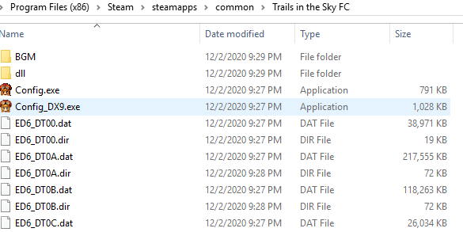
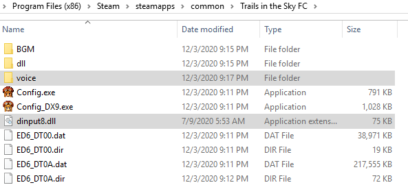

# Modding Trails in the Sky for Senior Bracers

> So you'd like to mod Trails in the Sky, aspiring bracer?

This page is an adaptation (with permission) of ShinKiseki's [Modding Trails in
the Sky for Junior Bracers][junior] guide, changed to use my [Calmare][Aureole]
decompiler rather than the venerable [EDDecompiler].

This guide is primarily concerned about modding scena (short for scenario)
files. These are essentially a series of scripts that tells the game's engine
about each scene in the game -- which characters are in the scene, where they
are positioned in the world, what they are saying, and so on.

## Setup

The game normally loads these from inside a file named `ED6_DT01.dat`. This file
is rather inconvenient to edit, however, so we will start by installing the
[SoraVoice][voice] mod, which, in addition to adding voices, also allows loading
these scena files from a normal directory.

1. Install the game and find its installation directory. It should look
   something like this:

   

2. Download `SoraVoice_*.7z` from [SoraVoice], and extract its contents into
   the game directory.

   

3. Download `en.fc_*.7z` from [SoraVoiceScripts]. It will contain a `scena/`
   folder; place that inside the `voice` directory.

   

5. If you wish, install the voice files themselves. This step is not necessary
   for modding, and so no instructions are given here.

6. Check that the mod is running. An easy way to do this, aside from just
   checking if there are voices playing, is that it will create a file named
   `ed_voice.ini` in the `voice` directory. If this file is not created,
   something went wrong.

If you've gotten curious and looked inside the `._sn` files, you may have
noticed that they are just binary data. This format is suited for the game to
read, but it is not readable by humans. To convert them to something that is
useful for humans, we will use [Calmare][Aureole]. Simply download the latest
[`calmare.exe`][calmare-latest] and place it somewhere easily accessible.

Next, drag `c0100._sn`[^filename] files onto `calmare.exe`[^drag]. A `c0100.clm`
file will appear next to it, with a (hopefully) nice and readable syntax. To
convert back to `._sn`, simply drag the `.clm` file onto `calmare.exe` again.

Hopefully, this guide will help you, aspiring Sky modder, set up your game to
properly mod your game!

As you may expect, prior experience with coding/scripting is extremely
beneficial. However, this guide is aimed to be accessible even for those who
have not programmed in the past. Each line of code that we examine will be
explained via comments, so we hope this will be easy to understand even for the
newest of bracers!

[junior]: https://docs.google.com/document/d/1Nflb-dBPLLl0yWwk3MJTo0UxNyRPZDgy5zPanSrtotM/
[EDDecompiler]: https://github.com/Ouroboros/EDDecompiler
[SoraVoice]: https://github.com/ZhenjianYang/SoraVoice/releases
[SoraVoiceScripts]: https://github.com/ZhenjianYang/SoraVoiceScripts/releases/
[Aureole]: https://github.com/Kyuuhachi/Aureole
[calmare-latest]: https://github.com/Kyuuhachi/Aureole/releases/latest/

[^filename]:
  The file will actually be named `C0100␣␣␣._SN`, but both due to personal
  preference and technical limitations with this markdown preprocessor, I will
  refer to it as `c0100._sn`.

[^drag]:
  Note that the exact behavior of dragging files is subject to change. In
  particular, I want it to be possible to drag multiple files at the same time.
  If I change this behavior and forget to update the preceding paragraphs, please
  poke me.
